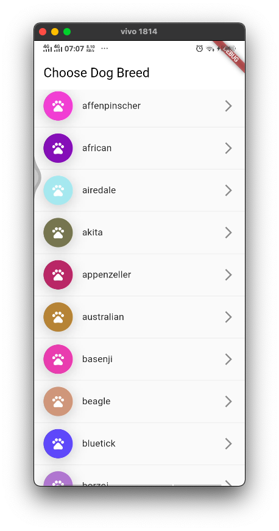

# dinder

Dating app for dogs

## Introduction

Dinder, a dating app for dogs only, this app created to help users to choose what breed they want to choose for their own pet.

The can select the breed in the list of breed scren, and when the user clicks on certain breed, it will bering the user to a new page to see the images of respective breed.

|   Breed List  |  Breed Images |
| ------------- |:-------------:|
|  |  |

## Data Source

This app use an external data from [Dog Ceo Api](https://dog.ceo/api)

## Dependencies

This app depends on:

- Flutter 3.3.8
- Dart 2.18
- Dio 4.0.6
- bloc and Flutter bloc

## How to Run

You will need to execute following command to get this app running:

- flutter pub get
- flutter run

## Acknowledgment

This is my first non tutorial app build with bloc.
Within the process to create this app, I search for several example in [Github](github.com), [StackOverflow](stackoverflow.com) and [ChatGPT](https://chat.openai.com/chat).

Also thanks for Mr. Hasbi from Glints and Mr. Chrisna from [Loratech.ai](https://www.asklora.ai/) that give me this challange to develop this app.

It is not a perfect app. There so much that can be added as improvement in this code, feel free to create a pull request.

## To Do

- [x] create breed list screen
- [x] create breed images screen
- [x] create unit test for api
- [ ] create unit test for bloc
- [ ] create widget test for each screen
- [ ] create integration test for each screen
- [ ] implement swipe animation on breed matching screen [reference here](https://github.com/shubhamhackz/dating_app.git)
